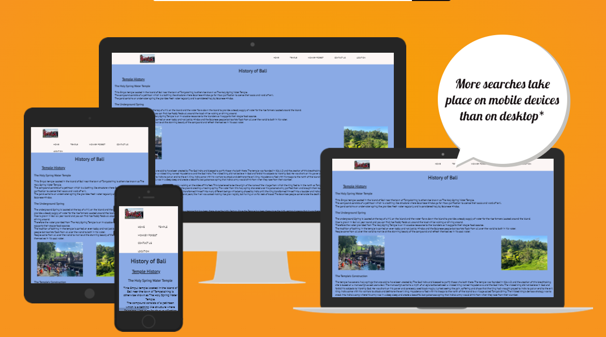

# Bali History Page 

**Developer: Matthew Carballeira**

[Live website](https://tillymc5.github.io/Bali-History-Page/)

## Table of Content

- [User Experience](#user-experience)
    - [Target Audience](#target-audience)
    - [User Stories](#user-stories)
  - [Structure](#structure)
  - [Wireframes](#wireframes)
  - [Validation](#validation)
    - [HTML Validation](#html-validation)
    - [CSS Validation](#css-validation)
  - [Testing](#testing)
    - [Accessibility](#accessibility)
    - [Performance](#performance)
    - [Testing user stories](#testing-user-stories)

  ## Validation

### HTML Validation

The W3C Markup Validation Service was used to validate the HTML of the website. All pages pass with no errors or no warnings to show.

All site

### CSS Validation

The W3C Jigsaw CSS Validation Service was used to validate the CSS of the website.
When validating all website, it passes with no errors found.

Style.css

## Testing

### Accessibility

The WAVE WebAIM web accessibility evaluation tool was used to ensure the website met high accessibility standards. The site currently contains 9 errors.

See evaluation summary

### Performance

Google Lighthouse in Google Chrome Developer Tools was used to test the performance of the website.

See evaluation summary

